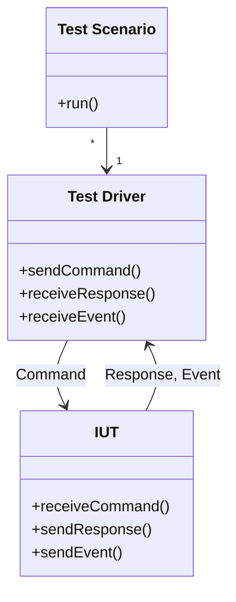

# Simple TCP/IP Test Driver

When creating software such as a protocol stack or machine-to-machine interface driver, the following setup is frequently used for system and integration testing.



Here, _IUT &ndash; Implementation Under Test_ receives a _Command_ and respond to the command by a _Response_ and optionally sends _Events_ as supplemental information.

`test_driver.py` works as a general purpose _Test Driver_ for the TCP/IP server programs, with logging features.

The driver is designed for IUT that is working as TCP server and uses text based interface protocols, but it can be extended by user defined `TargetConnector`, and for example, it is possible to support IUT that uses UART as its interface.

## Referenced Software

[Tera Term]:https://teratermproject.github.io/
In the case of Japan, [Tera Term] is widely used as a kind of test driver for this purpose and test scenarios are implemented by Tera Term Macro,
but it can not be used for the test cases that needs to control multiple servers.

The `test_driver.py` is affected by concepts in Tera Term Macro, and created to provide scripting interface for scenarios that needs multiple connections.

## Basic Usage with Sample Code

Following code can be used to demonstrate HTTP GET operation.
```python
from test_driver import TestTarget, TcpClientConnector

# Create test target for HTTP connection.
connector = TcpClientConnector('www.google.com', port=80)
target = TestTarget(connector=connector) 

# The 'start()' method initiates client connection and
# starts receiver thread that dumps received string via a Logger.
if target.start():
    # Send HTTP request.
    target.send_str('GET / HTTP/1.1\r\n\r\n')
    # Wait until '</html>' is received.
    target.wait_str('</html>', timeout=2)
    # And close connection and terminate receiver.
    target.stop()
```

Same procedure can be written as following, in this style,
connection is established and closed automatically.
```python
from test_driver import TestTarget, TcpClientConnector

# Create test target for HTTP connection and start reciver.
connector = TcpClientConnector('www.google.com', port=80)
with TestTarget(connector=connector) as target:
    # Send HTTP request.
    target.send_str('GET / HTTP/1.1\r\n\r\n')
    # Wait until '</html>' is received.
    target.wait_str('</html>', timeout=2)
```

## Features

Following list is summary of features. For details, please refer comments in the code.

1. Logging: all incoming and outgoing messages are logged by the logger.
   - Logging feature is implemented by `TestLogger` class and can be extended by users.
1. Send message to the server: the `TestTarget` class provides following method to transmit message to the server:
   - `send_str()` for string message, that corresponds to `str` type in python.
   - `send()` for for byte stream, that corresponds to `bytes` type in python.
1. Data reception: message received from server is stored into the RX buffer (`rx_buffer` member in the `TestTarget` class).
1. Find a string is exist in RX buffer or not.
   - `find_str`
   - `find_multi_str`
1. Wait message received from the server, the `TestTarget` class provides method to wait specified string is stored into the RX buffer. There is following flavors in this feature:
   - `wait_str()` &ndash; wait until specific string is stored into RX buffer. 
   - `wait_multi_str()` &ndash; one of specified strings is received.
   - `wait_any()` &ndash; some message is received from server.

Most of tests can be performed with these features. User is expected to implement other features using python.

### RX buffer

To simplify algorithm and avoid timing related problems, `TestTarget` class uses RX buffer as basis for `wait` functions.

This means:
- If the string is exist inside RX buffer, these function immediately returns.
- If the string is not exist in RX buffer, these functions waists until the string is stored into the RX buffer.

The `TestTarget` class provides `flush_rx()` method to clear RX buffer to manage message sequences.

### TIPS to implement complex features

Please use following attributes of `TestTarget` class to implement more complex features.

- `rx_buffer` &ndash; the list of incoming messages.
- `found_str` &ndash; the line matched by `find` functions or `wait` functions are stored in this attribute.
